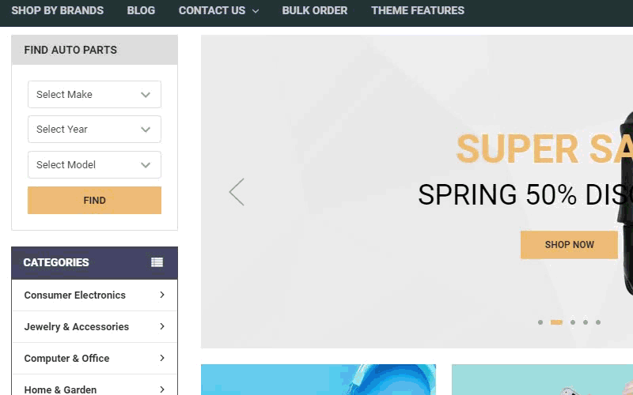

# Multiple Category Dependent Dropdowns


**Horizontal layout demo:**


**Vertical layout demo:**




**Vertical layout -  5 Levels:**


## Install on your BigCommerce store

### Horizontal layout

Go to **Storefront** > **Script Manager**, click **Create a Script**, choose:

- **Location on page** = `Footer`
- **Select pages where script will be added** = `All pages`
- **Script type** = `Script`

Enter the script below to **Scripts contents**: 

```html
<script>
    window.jQueryTheme = window.jQueryTheme || window.jQuerySupermarket || window.jQuery;
    window.PapathemesMCDDSettings = {
        renderToSelector: 'body > .body',
        usePrepend: true,
        rootCategoryId: 0,
        maxDepth: 3,
        lang: {
            heading: 'Find Auto Parts',
            category_label_0: 'Make:',
            category_label_1: 'Year:',
            category_label_2: 'Model:',
            choose_label_0: 'Select Make',
            choose_label_1: 'Select Year',
            choose_label_2: 'Select Model',
            submit_label: 'Find'
        }
    };
</script>
<script type="application/json" id="PAPATHEMESMCDD_breadcrumbs" data-instantload-body-dynamic>{{{JSONstringify breadcrumbs}}}</script>
<script type="application/json" id="PAPATHEMESMCDD_subcategories" data-instantload-body-dynamic>[{{#each category.subcategories}}{ "name": {{{JSONstringify name}}}, "id": {{{JSONstringify id}}}, "url": {{{JSONstringify url}}} }{{#unless @last}},{{/unless}}{{/each}}]</script>
<script src="//papathemes.com/content/mcdd/mcdd.YOURDOMAIN.js" async></script>
```

- Replace `YOURDOMAIN` by your domain name. For example: `mydomain.com`.
- Update `body > .body` in `renderToSelector: 'body > .body'` by the container HTML element selector to render the form.
- `usePrepend` = `true`: specify the form will be rendered on the top inside of the container HTML element.
- `rootCategoryId` = `0`: specify the root category to load its subcategories into the first dropdown.
- `maxDepth`: specify the number of dropdowns or categories to display.
- Customize words or languages in `lang` variable.


### Vertical layout

Go to **Storefront** > **Script Manager**, click **Create a Script**, choose:

- **Location on page** = `Footer`
- **Select pages where script will be added** = `All pages`
- **Script type** = `Script`

Enter the script below to **Scripts contents**: 

```html
<script>
    window.jQueryTheme = window.jQueryTheme || window.jQuerySupermarket || window.jQuery;
    window.PapathemesMCDDSettings = {
        renderToSelector: '.page-sidebar',
        usePrepend: true,
        rootCategoryId: 0,
        maxDepth: 5,
        verticalLayout: true,
        lang: {
            heading: 'Find Auto Parts',
            category_label_0: 'Make:',
            category_label_1: 'Year:',
            category_label_2: 'Model:',
            choose_label_0: 'Select Make',
            choose_label_1: 'Select Year',
            choose_label_2: 'Select Model',
            submit_label: 'Find'
        }
    };
</script>
<script type="application/json" id="PAPATHEMESMCDD_breadcrumbs" data-instantload-body-dynamic>{{{JSONstringify breadcrumbs}}}</script>
<script type="application/json" id="PAPATHEMESMCDD_subcategories" data-instantload-body-dynamic>[{{#each category.subcategories}}{ "name": {{{JSONstringify name}}}, "id": {{{JSONstringify id}}}, "url": {{{JSONstringify url}}} }{{#unless @last}},{{/unless}}{{/each}}]</script>
<script src="//papathemes.com/content/mcdd/mcdd.YOURDOMAIN.js" async></script>
```

- Replace `YOURDOMAIN` by your domain name. For example: `mydomain.com`.
- Update `.page-sidebar` in `renderToSelector: '.page-sidebar'` by the container HTML element selector to render the form.
- `usePrepend` = `true`: specify the form will be rendered on the top inside of the container HTML element.
- `maxDepth`: specify the number of dropdowns or categories to display.
- `verticalLayout` = `true`: Display the form vertically.
- Customize words or languages in `lang` variable.

### Insert on Supermarket theme

Go to **Storefront** > **Script Manager**, click **Create a Script**, choose:

- **Location on page** = `Footer`
- **Select pages where script will be added** = `All pages`
- **Script type** = `Script`

Enter the script below to **Scripts contents**: 

```html
<script>
    window.PapathemesMCDDSettings = {
        renderToSelector: 'body > .body',
        usePrepend: true,
        rootCategoryId: 0,
        maxDepth: 3,
        instantload: {{JSONstringify theme_settings.instantload}},
        lang: {
            heading: 'Find Auto Parts',
            category_label_0: 'Make:',
            category_label_1: 'Year:',
            category_label_2: 'Model:',
            choose_label_0: 'Select Make',
            choose_label_1: 'Select Year',
            choose_label_2: 'Select Model',
            submit_label: 'Find'
        }
    };
</script>
<script type="application/json" id="PAPATHEMESMCDD_breadcrumbs" data-instantload-body-dynamic>{{{JSONstringify breadcrumbs}}}</script>
<script type="application/json" id="PAPATHEMESMCDD_subcategories" data-instantload-body-dynamic>[{{#each category.subcategories}}{ "name": {{{JSONstringify name}}}, "id": {{{JSONstringify id}}}, "url": {{{JSONstringify url}}} }{{#unless @last}},{{/unless}}{{/each}}]</script>
<script src="//papathemes.com/content/mcdd/mcdd.supermarket.js" async></script>
```

- Update `body > .body` in `renderToSelector: 'body > .body'` by the container HTML element selector to render the form.
- `usePrepend` = `true`: specify the form will be rendered on the top inside of the container HTML element.
- `maxDepth`: specify the number of dropdowns or categories to display.
- Customize words or languages in `lang` variable.

