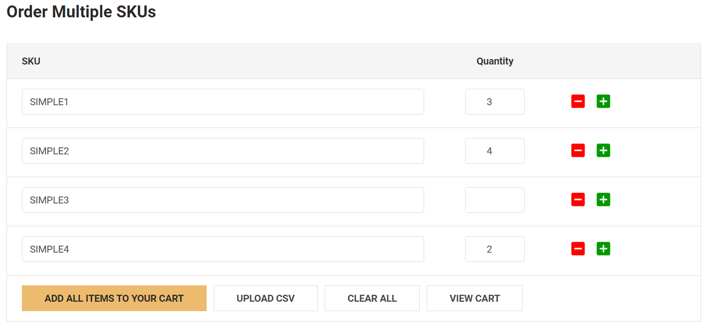

# Order Multiple SKUs



This extension allows to order multiple products by inputing product SKUs. Supports uploading CSV file for batch adding to cart. 

The order table can be displayed on any pages, any widget regions you want.

Does not require editing of your theme files. Works with all Stencil / Cornerstone based themes. The code is optimized, asynchronously loaded (parallel loaded), works fast and doesn't affect the speed of your website.

## Install the script on your BigCommerce store

### Step 1: Install the script

Go to **Storefront** > **Script Manager**, click **Create a Script**, choose:

- **Location on page** = `Footer`
- **Select pages where script will be added** = `Store Pages`
- **Script type** = `Script`

Enter the script below to **Scripts contents**: 

```html
<script>
    if (!window.jQuery) window.jQuery = window.jQuerySupermarket || window.jQueryTheme;
    window.PapathemesOrderMultiSKUsSettings = {
        renderToSelector: '#papathemes_ordermultiskus_app',
        csvSkuColumn: 'SKU',
        csvQtyColumn: 'QUANTITY',
        cartQtySelector: '.cart-quantity'
    };
</script>
<script src="//papathemes.com/content/ordermultiskus/ordermultiskus.YOURDOMAIN.js" async></script>
```

Replace `YOURDOMAIN` by your own store domain. Example:

```html
<script>if (!window.jQuery) window.jQuery = window.jQuerySupermarket || window.jQueryTheme;</script>
<script src="https://papathemes.com/content/productswatchesaddon/productswatches.mydomain.com.js" async></script>
```

### Step 2: Create "Order Multiple SKUs" web page

Create a Web Page in **Storefront** > **Web Pages**. View the created page in Page Builder, add the HTML widget to and position you want to display **Order Multiple SKUs** tab. Enter the code below to the HTML widget's content:

```html
<div id="papathemes_ordermultiskus_app"></div>
```

Access the page from your storefront, you should see the "Order Multiple SKUs" table displayed.

## Settings

All these options are optional.

### renderToSelector

Specifies the element selector Order Multiple SKUs table should be rendered to. Default is `#papathemes_ordermultiskus_app`.

### csvSkuColumn

The column name that contains product SKU to order when using CSV file upload. Default is `SKU`.

### csvQtyColumn

The column name that contains product quantity to order when using CSV file upload. Default is `QUANTITY`.

### cartQtySelector

Specifies the element selector to update cart quantity after added products to your cart. Default is `.cart-quantity` that should work for any Sencil themes built based on Cornerstone theme.

